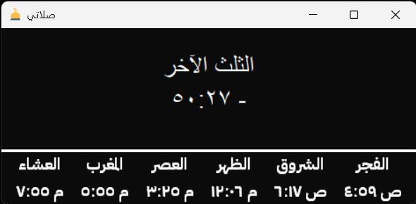

## Salati - صلاتي

## صلاتي (Salati)

يرسل إشعارات للتذكير بمواقيت الصلاة.



`صَلَاتي` هو برنامج صغير بلغة بايثون يساعد في: حساب مواقيت الصلاة، إرسال إشعارات في الوقت المحدد، وإدارة إعدادات المستخدم.

الملفات الرئيسية في المستودع:

- `صلاتي.py` — نقطة الدخول للبرنامج (واجهة أو سكربت التشغيل).
- `prayerutils.py` — وظائف حساب مواقيت الصلاة.
- `notifications.py` — وظائف إرسال الإشعارات.
- `settings.py` — ملف إعدادات (موقع، صيغة الإشعارات، تفضيلات المستخدم).

### 

> ملاحظة: الأوامر أعلاه مهيأة لبيئة PowerShell على ويندوز.

### التشغيل

لتشغيل البرنامج:

```powershell
python .\صلاتي.py
```

يمكنك أيضاً تشغيل سكربتات منفصلة للاختبار أو للأغراض المساعدة، مثل:

```powershell
python .\prayerutils.py
python .\notifications.py
```

### التكوين

افتح `settings.py` وقم بتعديل القيم التالية حسب موقعك وتفضيلاتك:

- خط العرض (latitude) وخط الطول (longitude)
- طريقة الحساب (مثال: ISNA، MWL، Umm al-Qura)
- تفضيلات الإشعارات (صوت/نص، قبل/بعد الوقت)

### كيفية المساهمة

المساهمات مرحب بها:

1. افتح Issue لوصف المشكلة أو الاقتراح.
2. أنشئ فرعًا جديدًا (branch) وأضف تغييراتك مع اختبارات صغيرة إن أمكن.
3. افتح Pull Request مع وصف التغييرات.

### تواصل

للمزيد من الأسئلة أو الاقتراحات، افتح Issue في هذا المستودع أو تواصل مع صاحب المشروع.

