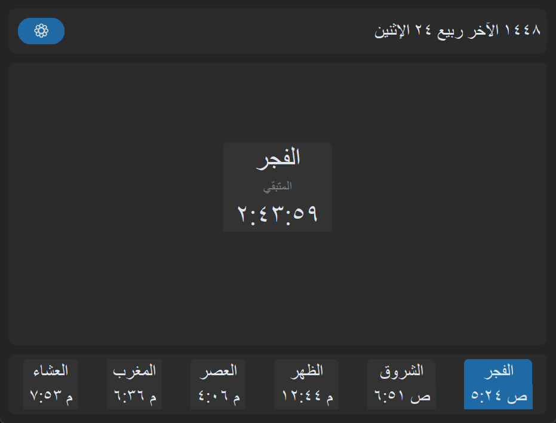
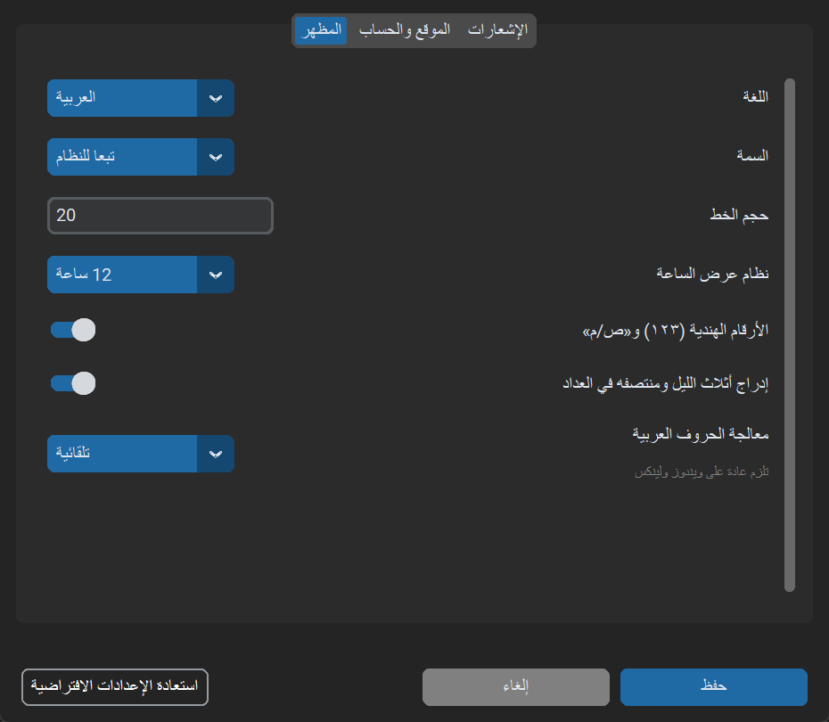
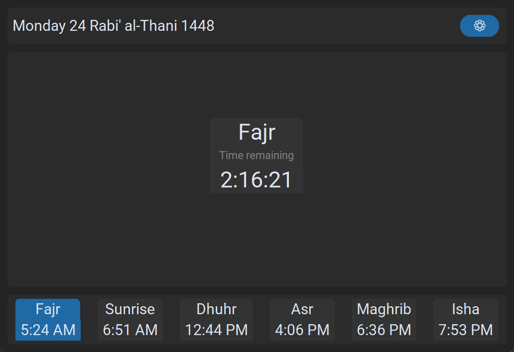

# صلاتي | Salati

تطبيق مكتبي بسيط لمواقيت الصلاة: عدّاد تنازلي للصلاة القادمة (ثم تصاعدي بعد دخول الوقت)، وإشعارات، وصفحة إعدادات تتحكم في كل شيء.



## المزايا

- واجهة **بالعربية والإنجليزية** (من الإعدادات)، يتبدّل معها اتجاه التخطيط ورسائل الإشعارات.
- مواقيت الصلاة من [Aladhan](https://aladhan.com/prayer-times-api)، مع التاريخ الهجري، وأثلاث الليل ومنتصفه.
- **عدّاد** تنازلي للصلاة القادمة، ثم تصاعدي بعد دخول الوقت (المدة قابلة للضبط).
- **إشعارات** لكل صلاة بأكثر من إزاحة (مثلاً قبلها بعشر دقائق وعند وقتها: `-10, 0`).
- يعمل **بلا إنترنت** بآخر مواقيت محفوظة لليوم.
- تحديد الموقع تلقائياً عبر IP أو إحداثيات يدوية، وأكثر من 20 طريقة حساب.
- عرض العربية بترتيب الكلمات والحروف الصحيح على ويندوز ولينكس عبر [ArabicDisplayer](https://github.com/510o/ArabicDisplayer)، لأن Tk يرسم الكلمات من اليسار إلى اليمين.





## التشغيل

يتطلب Python 3.9 أو أحدث.

```
pip install -e .
python main.py
```

المنصات: جُرّب على **ويندوز**. لينكس وماك لم يُختبرا بعد (معالجة العربية على ماك معطّلة افتراضياً). إن ظهر النص العربي معكوساً أو غير متصل فاضبط «معالجة الحروف العربية» من الإعدادات، ويمكنك فحص نظامك بـ `python tests/render_check.py`.

## الإعدادات

تُحفظ في `~/.صلاتي/settings.json`. كل إعداد معرَّف مرة واحدة في [src/schema.py](src/schema.py)، ومنه تُولَّد القيم الافتراضية والتحقق ونافذة الإعدادات. لإضافة خيار جديد أضف سطر `Setting` واحداً.

## البنية

| الملف | المهمة |
|---|---|
| `main.py`، `src/app.py` | نقطة الدخول وربط الأجزاء |
| `src/schema.py`، `src/storage.py` | تعريف الإعدادات وحفظها |
| `src/api.py`، `src/timings.py` | جلب المواقيت وتخزينها مؤقتاً |
| `src/prayer_logic.py` | العدّاد وجدولة الإشعارات (دوال نقية) |
| `src/notifier.py` | الإشعارات في خيط خلفي |
| `src/i18n.py` | الترجمة إلى الإنجليزية (النص العربي في الكود هو الأصل) |
| `src/text.py`، `src/time_utils.py` | عرض العربية وتنسيق الوقت |
| `src/ui/` | النافذة الرئيسية ونافذة الإعدادات |
| `legacy/` | النسخة الأولى من المشروع |

## الاختبارات

```
python -m unittest discover -s tests -t . -p "test_*.py"
```

## الترخيص

MIT، انظر [LICENSE](LICENSE).
